# 2023-12-13 How the version page reasons about what to load

- status: accepted
- date: 2023-12-13
- authors: Mohamed Khelif

## Context and Problem Statement

The version page can have multiple states and every time it is loaded there are
a series of checks that need to be done to determine what to load or if we
should redirect to another page. This document aims to describe the logic behind
the version page.

## Decision Outcome

Please reference the below flowchart for the logic behind the version page.

```mermaid
flowchart
	480632["getPatch(id)"] --- 565589("Error")
	style 480632 fill:#acc6ff
	273918["getVersion(id)"] --- 565589
	style 273918 fill:#acc6ff
	965472(["setIsLoadingData(false)"]) --> 616311["redirect to patch configure page"]
	style 965472 fill:#a097ff
	style 616311 fill:#00ff33
	480632 -->|"is not activated and is not on commit queue"| 965472
	2["hasVersion(id)"] -->|"does not have a version associated with the id"| 480632
	style 2 fill:#acc6ff
	2 -->|"has a version associated with the id"| 273918
	2 --> 565589
	273918 --> 860357(["setIsLoadingData(false)"])
	style 860357 fill:#a097ff
	860357 --> 750648["show version page"]
	style 750648 fill:#00ff33
	480632 -->|"is activated"| 273918
	480632 -->|"is not activated and is on commit queue"| 764900(["setIsLoadingData(false)"])
	style 764900 fill:#a097ff
	764900 --> 164931["redirect to commit queue"]
	style 164931 fill:#00ff33
	1{"User Visits /version/{id}"} --> 273769(["setIsLoadingData(true)"])
	style 1 fill:#00ff33
	style 273769 fill:#a097ff
	273769 --> 2
	565589 --> 229436(["setIsLoadingData(false)"])
	style 229436 fill:#a097ff
	229436 --> 835273["show error"]
	style 835273 fill:#00ff33
	142529["GraphQL request"]
	style 142529 fill:#acc6ff
	497431["User visible feedback"]
	style 497431 fill:#00ff33
	539322(["State Transition"])
	style 539322 fill:#a097ff
	891333{"User Interaction"}
	style 891333 fill:#00ff33

%% Mermaid Flow Diagram Link
%% Keep this link to make future edits to your diagram
%% https://www.mermaidflow.app/flowchart#N4IgZgNg9g7iBcoB2UAmBTAzgg2qGAlqgC4AWCAjAJxUA0Ip6BA5qcQgEwAMH9RCICiHoAHKJgLECUJAlAAPShwoB2AHRUAbCpUAWXTQDMxlZvoBPBAFpDXNRwCsADi66uXB4Y40tDgL70qACGxEFyIADGEEGYmFi4ALr0mMTmEPHwOOAEEBDwAMTuYGDGIEkg0QBG6BACAKpxAE4ABABqBBLEmM0A9ABu6I0SMj3ARH7CIKgEjegRUjICACoAQpONQUgA1pgAIhswsogBICJBs0jEAEqbWwhcgQcAyqnpCGBBEHEnqSLoAo1SFAALaVACumAAcmh-slXv9jskanNiOhUO9PnFROJJNIkABBSqYKAQMGo8KKeAUZTqLQ6fRGExmECWeA2OyOFxuDxeHyafyPILMZgEJDMDFfdABfBEMiUfT0RgsNgIFx8dHwEAcSZiTp4ilKTS6NS6TSGFRcKgUbQ6FQWBCeQwmrheF2GJzKK2aE7BULhKIxOLYTLlFJpDJZMA5PL5IIRCKaYplehVGoCUgxVqDYZIAAURAAlJNprN5vrNat1rc9gcjsATmcLtdbvdBTAXuGJd96L8ESBS6ExeloRhJmG3oiQHF0vM0V30Ni9TJCcTSeTECBKdSjSazRavba7SyHcZna7jB7qNafRthaLxfAPpLpSBCCRyFT+YqmKx2PA1SA-CahQuiON4Oo4gsdabvKnj2A49qfhQPohGEG4BrEEahvCwaRtGBRxgmSblKmtSagA4hsIikAAigAMs0swAI5glg7CBDMKLliAlb0Bs2w1kEhxyA25zoJcNzbK2UzPPC84-OYfwAiimzMMOMJjnJk7Tiic6PpiC6nJBeIriSZIIgosFOo4iHWshL5vnK8AcNw37Kn+AFAYIRpUIYQiLriiwbpSDgqBwagqAhx5UtuKF+uh0SYbh2Hhrh2S5AURQlIYyYVEE1Rkf2aKcfMzTEFAzQRCCwKSM0LHoKxxYlVByxrHx1b7EJdaiU2kl3PADwyUJHYTk+3YgL2ynzKp6mjnCnbacis4amNhm6oFBJEmZ66WfAoXhZFtmxQ5softwuhub+CBheqAguVQuiGJoEFLtBlJUNw9iaMohhUFwegODwFC2RwfkmhwegUE4xgOLDoFxWhoAYUGiTzekaVRhlsaWioxEpvlaaanExAAJKYHRUBBNMYq7KhuarUWHEDtxvH9h1tYiaIYkSS2A1tiNCKrQpSmaiI0YjrCU5afWSIzqiK0GQFUGmWuFkwfAH0ct9FC-f9uiA8oINg6BkPQ4YsMOPDgp3mK8m0DK76UFQTiXSq8A3YBGpaio5qaFQL0bQaVKg8ah3RV4HAI-6iUoyGaMRulMZBDjeN5QVAjE2TFNU-etOhLmxCNKxjNTM1LNtWzAmdcJk6NuJzZSXzQ3tlpQs9opfZi7kEuaQtMtTkt8vzkrJlbarQfUoYodRayEd+CdjtUgqDA-m7nlexDv1QwHLXBUoyhqJomjUpFbp+RwF3RU4+hqE4TgqJPEOw16UcJYGWHxxj+GxvGiZgLlpEBDMHQMQLMQw8T5lQCXEsXEgo8QrvxHY1dupc16rzQaqBZILTbhNDuU1BxqXQD3eOnMB5yz0qtEey4x7mQni5Cgh9j5PzPtSS+rJr7Gjvg-UGT8HAv2tiKW2+lnz21fKdeUl8lRXX-INLyugXBmm1FQt611YZqAoJ4EOzt3DUhntdKeEUPB7gcNafk31X5Ixjh-KWqVcCJwIr-VOgDNTAOIAABRCBEUgkDoFlzgazRBgka79zrjzRuGCsGjQMsLPsA4ZpEI0iQxa5CFaSmUSrWhe93ZqI0V4Ke2iuC6MQj7UORjzQmKPg4cxAj7x2wdk5agkjV4eVkV7Aweg-I73LLtJwlt4K2WPhYyIVjkqfzsZjGMWVSgkQJoVBogxmh9A6AQSo6RmhgHQGiSocY7hM1gUceBVYq4c1rtzBu-UInDVbtE9uIsirTSHAkuaNiJz9x0stYeRlXoZJ2urXpxobLRTsjeIUgiHxt3qR+ECzIpFuw9l5TwvkXJdKCrtCgXBNBOH6UC-kQzkbWPHAnCZBEU7-xmenTULwQjoGaEsfir0mrM38Qg9mXVSGhPOdJTBVzsE3NwXcruEBiEvIsicd5Q9hFYi+RtH5astwYqxYC1k1p-ALwacvWFLTbqaiqbDJw-tlF0JMSaaGvSj5UB0M4QwR1Pr7WcKY-Q+snB4pGajEVoy06ExAAAUUaI0KAjRGX7NakcpBJyQlnL6lyyJCJC6sRiQCKAYIkAYFQFcFSjzhWEtIeKihitpXKxob8rcjgGHyPdFUv2lroY2rsHapwDr9DOBBTbcFNzIWcD9q7LVnsBDHzNBQfyBbunq1UIqv6XhKk6DNmw66ugGEXz4V4UKR8oYqBde-D1hKv5YymTlclXrZgwNKuVZoZxiBeMqjIKMzAwSzDPUKSWx7d6HPasctlpy0HhP5tckR-LYkZsIVm6WYrB55rScO6hq5MlopUOOl0HAp1weMLO92877D6yRSu4+98W1grqWIxeqgjyatVK0gQp8jROBRSoqkoUqAaDNDaKpNAqm8GitotQ9bG1Oo3UlN127xnfz3QA2ZGcgQwEWdmPED7gFBrLMy0NQSUGnEjegn9vK-2TU1HEzNiSRU5rA6kqV61C3QeLZQejjGnqWr9lQNjiFOPcaPo65tNShEQsI05c63brrsa8qYAw7gaNB2cHYMOrIaBcD47HHAKV0ZCaxsnC1TixNExAVnSm1NmB5yCPTAyvimUHICay4JPV65RqbtylumnxradOOLfT2bkm6WM2tYyUHtpyodC4CKeiNZ-Tw7UyVUpRGOShRq5pZHtUgGhg4TeIWsmDvNFxrgLgH78kHdwOgQLQIMOpJactkV5tUBiwSnCiXJlcGKNM-GFKpwSeaIMf1ga9kKeKyy99ZXUEVfU83AWdt-34PicBvuoGUmfNM6Pcz3WYorcButlVW3LS2T2+o7bR3YbeCGx59tXmzquF8+7fzXsnCaBdKFRbaLQp2H1lUjwVo77m361Wk0fCLQGG5L7M7W6LuZHsdjFLZK7teszuTLLuc6YM3ky+krX2VMcsq5cmrUStN4NFo155zW3lGchx1zaMOJ407Z-TvhUM5ss4tWzi1rgHruG5+5ttIiO1LxdivdylB4Wk6tMYHKhqsmYs0Ni5VGiecCb53hXd13sqifu-MloJNLiDDjC1N7svPtho-RGr9FyNOq7q+r-sQJQQQlB688HrW9ffKLbDwPwfKCh7VQTppHviczd8LoMKVP1ZPR26yUCkdAioWjpu8Ptj+fEsF7jYXnrCpi+ztl3L+XJSFeDRWDPyn2Vqe-f939BeBWa8ltrivHyRvpJr0HXviEB846d98coaJgG4VAPViIEJyrAkmMCc4WxBhUsaH+CAFAH8LIPQN-o0L-o0N6imgIMAeJJMKKKiBsO9gAOriLOSDTa5Sz+q-5oFEYnBeSP7oBWDPzzq2CmAYp+5ThJqNARB9jyKUFKITTnCuICC6rOAGrMGNCuIAASmwqAE4ggY4NBdBfBKaghQ6voiMs+Agkw6QYoDSJ+Eqnmr+7+IIX+P+f+oQABsBIBGhEBgw0BXscBoBgESeyBUEeB3mmB0s2BUAuB6ByEM2RBVgH018iKJiiGXAwhd6dBd0PsjOkw2hrBOq-IHBQRLBICYhAhfYQ6xIvh6A0REhxYw+G4ziIAch4kzAihssleI2L4qhKQ6hYBmhjQ-+gBJh+hkBRhAgYgiBCB5hKeeIVhBOSSoAKQOB6ALRlAYqIhfYHeXeyQfRSRfYTBwRICfa1ofkQ64xxAIxAgQ6hBqAwCVg30v0D0HO98ugkwmwBA3+yh+aUh4QzWWQHR9h6ABQlQFAVxlQz0CQSh4G3YL+heb+RRn+JRBhZR2hFRehHx1RMBosUA9RfAjRqB6BrkBmG4ZxDh+BQxCRAgDBiiPhtBiR-ByRPYkRgBAxYxmJ8xmoTBSxKxqguiEM6K183h9Aux+xjxhkRxUJWkpxhc5xlx1x1xdxIuEA3R8AKGHJPBU2zkl8HQ3q0wUguOEG6RHQzQKAxAzQTRfQ1KqAspKazQkp0pzQMgV6wINUMp9UjUDxbWBRLxah7xIA4BkB5Ruh8BfxhhAJRkwJZhSBTRMgXJEJWB0JXRjhvR8J+JyJohaJoxER3BExmoiJXggZvB-pCxCBXsLhZOVoygDaGi1oOxSAexCpnydJ7RDJdhv+LJNx7Js+XJ5s1qs+fJreF8fAmAwpuIYpUq6RqAUAWAUpUAMpGYAwspUm4CGpgYUAEQBACpzQhAZAZUjAKp6I+pBGhRH+VRWh5wPxVppppRNRgJ9piByeYJi8rpth7pXJTh1B3pWovpqJ4hAZGJQZgBm8gRZ5EZJ5UZzhyxxBmG5opgx2R8KZaZBxEGmZkJjJnReZbJseNQLpcGvJ-JFZgEVZIpw2lCMhmoGY3QQQnZOYspsQvZ-Z8sg5kgpAI5NK-AE5+RoiU5xRi5nxFpmolR1pUBtpdRlwDRjpG51hbROZHpsJ+5KJd0R5eJh515wZIA7B+q4ZURkZwE0ZAgsZqgLkFS9CKg751JbWQ+8UWZC0v5zJ+QNxAF9xuRp+KhRpbxM5Xxc5lpphZpNpXsNF7EDp65lh4JNhfczFu5Xp7F+JAR28cJKJXFOJ55AgZOFOMlPFcxwlQh95KxLgDa9mq6OsTBVJ6ZZ+UwqRSlE4KluZalrJtxZQ+FOldyrx05lFZFQBvxJF-xZlQJtFIJ9F1lm5tlry9lnpblfhmoPl5sflbFfpt5Pp-lFGgMVGglAVbVQVvamosZ185Bqga2rlIA0Vn5Uq35JxzF-5aVmlZCeRmVfY2VxFJlBlOh5FBVG1y5dppVllFhzRNlTFO5tVLV9BCiYZdVx5MRHFHVzlW81G-lXFixMZD5JBZO+q2gZJkUslMVMFM12Z7p81BZpEu5HgoF5ZgpkFNZd+hkEpCFZY8pQ8GVeORFJpG1eVFFhVpltRJVFla5R1zpJ1kJWZnRDlN1CJV1TB8R7lgVnlIRIAgWf0FJXBN5d1IlwVxB5o5oOsBgls8i-1U1tJ8VP5c1KV+ZgFnJ6BtgzIpEZZ0i4FQpUFtZCNaWEFzZMpcpA5-BKp3QGpVUWptUup-waNzuQOmoa1mNpR2NO1S51FBNdFVlx1lVp1TJMJORF1FGPkwWN1HlPVCxPknSL1gVb1YlH1qgVog6183gLowtNJCl0hs1INktGl5tTxltkQxp+ldtC5u1jtq5oJFVjFZNNVrFdN9V-Vldt1ghjNvFm8pgnBsxr1olg1H1R85oPCkUpoz1E1qZclGZYtKdHtFxadC1Gdo2zxWVOduV3xRl+le15lztxNSALpVVasZ1FdfR-hvsnBNdAdD13F7NQlfV4d7dKxQWmG1IIEngCd8lcVil4tqd6lE9WlIthpM9elc9hl21+dDtxVRd5Vrtpdbpo9lN3toReq+9wxDNgd+J3gj0z0odZ9bdIALhbgZofCiZno99Q9T9I9f549dx88hFulOVuNm185xlAD+NQDLtJNbtZdW9XtNdd0iDT0nFcDR9c2C2KDnN-VhJxBjOWgOsXgponBk1idj9ydwNo9oN6Vfg5QSy6AMAYgW1u0NgDG9mvdmKOgXgYUpgjmQef0neoMcZzsoEbuAAXlAOoQNGoE9NfEYIhohn5JbIYKQ6XEKBsMCAALIgJBC5bhDPrlyTBgD+qXB+MhBIHhBSDECCEgA+hlwDAepG3Aj1xpOuohgEFVnyDqPuKbA1AADyeh8AcahkakUA2yEAwpwCSw6uoAqAYInwnyEAoo6ADTdyq4-A9ARB0TnxXTncTt9AVU0AgamoxDST9AVTNTEsQzcTheumQG+mYzAaAghQ7gWzkw2yEQWwzA-qyaqAAAwiSOs5M8ltPjswGhgI0Kc+Mxs1s9s-QJUDc4MEsKQAQHs0gFgMGNQe0+iJWbTJgIwAaX4EAA
```

<!-- This is an optional element. Feel free to remove. -->

## More Information
